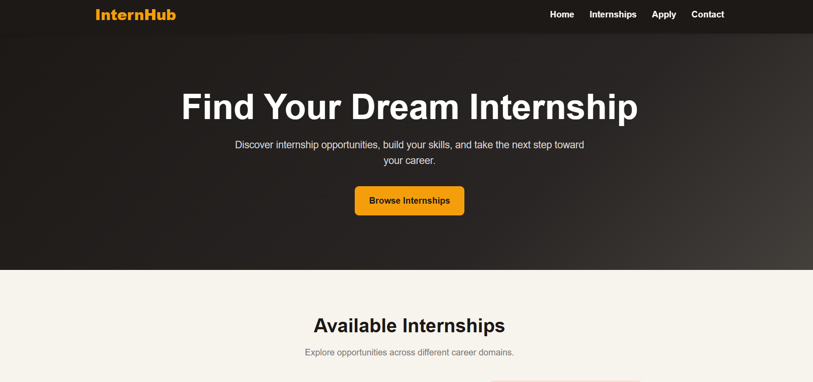
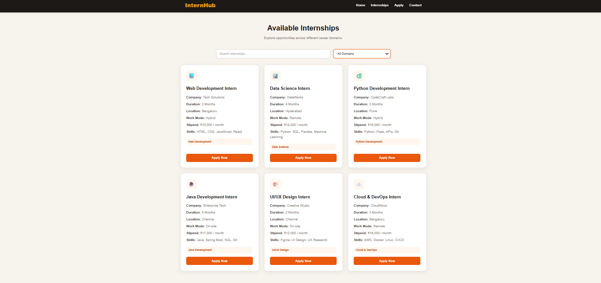
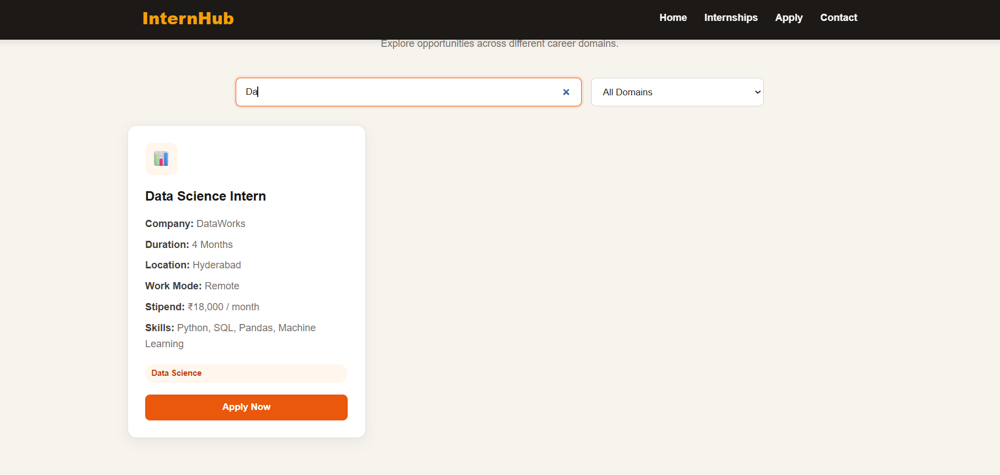
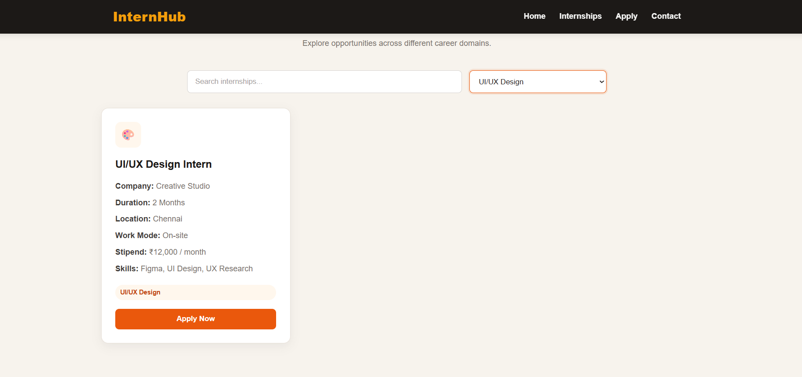
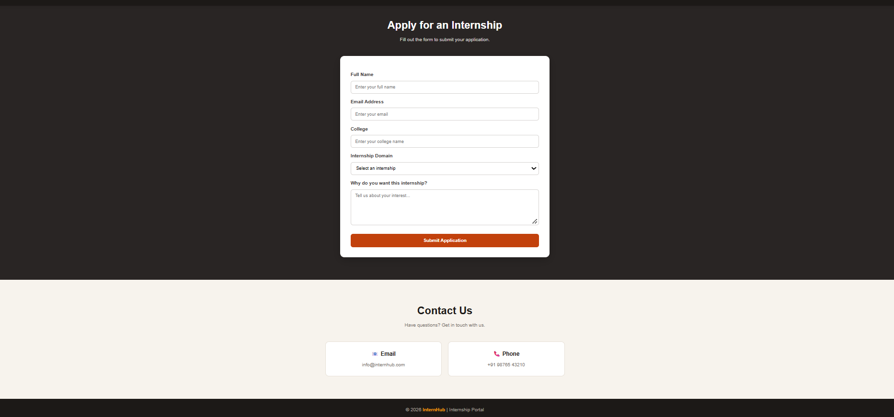

# InternHub – Internship Portal

A responsive frontend web application designed to help students explore internship opportunities, search and filter internships by domain, view internship details, and submit internship applications through a simple and user-friendly interface.

## 🚀 Live Demo

**Live Demo:**
Not deployed yet

---

## 📌 Problem Statement

Students often search for internship opportunities across multiple platforms, making it difficult to:

* Find internships based on specific career domains
* Quickly search through available opportunities
* Compare internship details
* Identify required skills
* Understand internship duration and work mode
* Navigate the application process easily

InternHub provides a centralized frontend interface for exploring and applying for internship opportunities.

---

## 💡 Solution

The application provides a simple internship discovery workflow:

**Browse Internships → Search → Filter → View Details → Apply**

Users can explore available internships, search using keywords, filter opportunities by domain, and use the **Apply Now** button to quickly open the application form with the selected internship.

---

## ✨ Key Features

### 🔎 Internship Search

* Search internships using keywords
* Search by internship title
* Search by company
* Search by skills
* Instant search results

### 🗂️ Internship Filtering

* Filter internships by career domain
* Web Development
* Data Science
* Python Development
* Java Development
* UI/UX Design
* Cloud & DevOps
* Display a message when no matching internships are found

### 💼 Internship Details

Each internship listing provides:

* Internship title
* Company name
* Duration
* Location
* Work mode
* Monthly stipend
* Required skills
* Internship domain

### 📝 Application

* Apply Now functionality
* Automatically selects the chosen internship
* Application form validation
* Full name field
* Email field
* College field
* Internship selection
* Motivation/message field
* Application success message
* Form reset after submission

### 📱 Responsive Design

The website is designed to work across:

* Desktop
* Laptop
* Tablet
* Mobile devices

### 🐳 Docker Configuration

The project includes a Dockerfile configured to serve the static website using Nginx.

---

## 🛠️ Technology Stack

### Frontend

* HTML5
* CSS3
* JavaScript
* Responsive CSS
* DOM Manipulation

### Containerization

* Docker
* Nginx

### Development Tools

* Visual Studio Code
* Git
* GitHub

---

## 📸 Screenshots

### 🏠 Dashboard / Home



### 💼 Internship Listings



### 🔎 Internship Search



### 🔃 Internship Sorting & Filtering



### 📝 Application Form



---

## 🏗️ Project Architecture

```text
Internship-Portal/
│
├── index.html
├── style.css
├── script.js
├── Dockerfile
├── screenshots/
│   ├── Dashboard.png
│   ├── Internships.png
│   ├── Searching.png
│   ├── Sorting.png
│   └── Application.png
│
└── README.md
```

---

## 🔄 Application Workflow

```text
Home Page
    ↓
Browse Internships
    ↓
Search Internship
    ↓
Filter by Domain
    ↓
View Internship Details
    ↓
Click Apply Now
    ↓
Application Form
    ↓
Select Internship
    ↓
Submit Application
    ↓
Success Message
```

---

## 🧪 Testing

The application was tested across the major frontend workflows:

* Navigation between sections
* Internship search
* Domain filtering
* No-results handling
* Internship card display
* Apply Now buttons
* Automatic internship selection
* Application form validation
* Application success message
* Form reset
* Responsive layout
* Mobile layout
* Desktop layout

---

## 💻 Run Locally

### Clone the Repository

```bash
git clone https://github.com/Pavithrapavi25/Internship-portal.git
```

### Navigate to the Project Folder

```bash
cd Internship-portal
```

### Run the Application

Open `index.html` directly in a web browser.

Alternatively, the project can be served using a local development server.

No backend server or database is required.

---

## 🐳 Docker

The project includes a Dockerfile for serving the static frontend using Nginx.

### Architecture

```text
HTML + CSS + JavaScript
          ↓
       Docker
          ↓
        Nginx
          ↓
     Web Browser
```

Docker is optional for local development.

---

## 📌 Project Scope

InternHub is a frontend-focused internship portal created to demonstrate:

* Responsive web development
* Modern HTML structure
* CSS-based responsive design
* JavaScript interactivity
* Search and filtering
* Form handling
* DOM manipulation
* Basic containerization
* Nginx static file serving

The internship listings, company names, stipend information, and contact details are sample data created for demonstration purposes.

The current application does not have a backend database or persistent application storage.

---

## 🎯 Project Objective

The main objective of this project is to create a practical and user-friendly internship discovery interface that demonstrates how students can browse, search, filter, and apply for internship opportunities from a centralized platform.

The project focuses on frontend usability, responsive design, and interactive JavaScript functionality.

---

## 📚 What I Learned

Through this project, I worked with:

* HTML5 semantic structure
* CSS3 responsive design
* JavaScript DOM manipulation
* Event handling
* Search functionality
* Dynamic filtering
* Form validation
* Interactive UI components
* Responsive layouts
* Docker configuration
* Nginx static file serving
* Git and GitHub
* Project documentation

---

## 🔮 Future Improvements

Potential future enhancements include:

* Backend API integration
* User authentication
* Student profiles
* Company accounts
* Real internship database
* Persistent application storage
* Resume upload
* Application status tracking
* Email notifications
* Admin dashboard
* Internship posting functionality
* Advanced internship filtering
* Cloud deployment

---

## 👩‍💻 Developer

**Pavithra**

AI & Data Science Graduate | Software & Data Science Enthusiast

This project was developed as a practical internship portal application with a focus on responsive frontend development, JavaScript interactivity, search and filtering, form handling, and containerized deployment.
